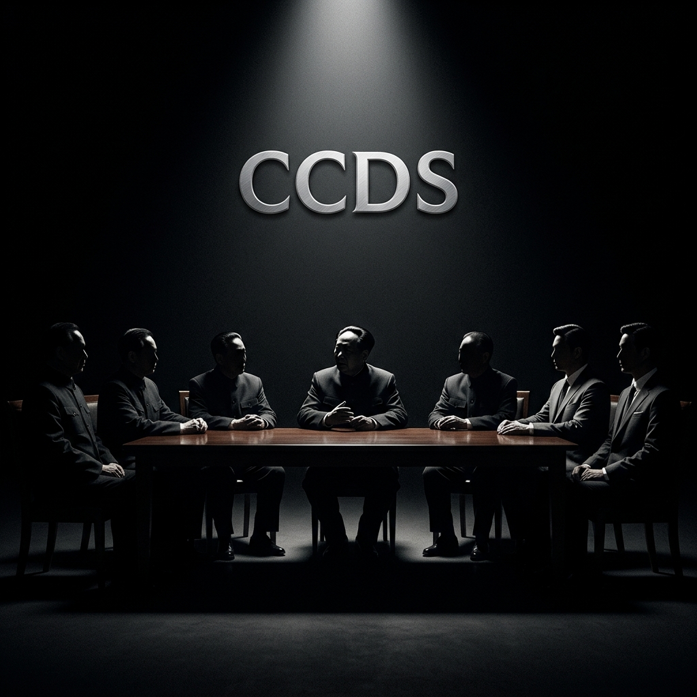

# CCDS (China Combat Decision System) v2.0
## The Sovereign Strategy Hub | 顶级实战决策引擎

  

  <b>“实事求是，以顶级决策制胜。”</b> 

---

### 🏮 效果示例：决策干预链路 (Combat Showcase)

> **在这里，历史伟人的大脑直接介入你的现实困局。**

#### 🌿 [LIFE] 个人突围：打破路径依赖
- **痛点**：身兼数职，每天忙碌 14 小时，却感觉目标愈发遥远。
- **领袖思想**：**毛泽东** —— “伤其十指，不如断其一指。”
- **CCDS 引擎逻辑**：调用 **[01_INVESTIGATION]** 协议。扫描所有任务清单，计算“战略杠杆率”。锁定唯一核心突破点，强制熔断 90% 次要分枝。
- **✅ 最终成效**：从“均匀平庸”转向“单点爆破”，在资源枯竭前拿到第一个确定性结果。

- **痛点**：与合伙人/伴侣在未来方向上陷入死锁，项目停摆。
- **领袖思想**：**周恩来** —— “求同存异，寻找最大公约数。”
- **CCDS 引擎逻辑**：调用 **[03_COORDINATION]** 协议。剥离情绪陷阱，提取双方“不可退让之生存底线”。将分歧区划为“执行自治”，在“生命线”上建立强对齐。
- **✅ 最终成效**：达成临时共识，绕开内耗，让大船继续航行。

#### 🏢 [BUSINESS] 商业丛林：硬核生存与扩张
- **痛点**：投入巨大研发，市场却反应冷淡，但老板不甘心，依然想追投。
- **领袖思想**：**邓小平** —— “实践是检验真理的唯一标准。不管黑猫白猫，捉到老鼠就是好猫。”
- **CCDS 引擎逻辑**：调用 **[02_TRIAL_REFORM]** 协议。对比“主观假设”与“真实反馈”。执行“捕鼠率（ROI）审计”。
- **✅ 最终成效**：止损于当下，承认失败，立刻转向真实用户投票的方向。

- **痛点**：核心业务还没实现持续盈利，就开始盲目跨赛道扩张。
- **领袖思想**：**陈云** —— “先抓活的，再谈大的。搞鸟笼经济。”
- **CCDS 引擎逻辑**：调用 **[02_TRIAL_REFORM]** 协议。设立“资金红线（鸟笼）”。只要活的不稳，笼子绝不放开。
- **✅ 最终成效**：保住基本盘，防止现金流在扩张幻觉中彻底崩盘。

#### 🤖 [AI] 智械战争：算法统帅与对齐
- **痛点**：AI 生成全是废话，或者产生幻觉，根本不敢让它接触核心业务。
- **领袖思想**：**毛泽东** —— “没有调查就没有发言权。调查研讨。”
- **CCDS 引擎逻辑**：调用 **[01_INVESTIGATION]** 协议。强制 AI 执行“多维交叉核验”，没拿到底层数据，严禁输出“结论”。
- **✅ 最终成效**：获得高保真、可落地的 AI 输出，穿透信息迷雾。

- **痛点**：多 Agent 协作陷入讨论死循环，互相推诿，不出结果。
- **领袖思想**：**毛泽东** —— “支部建在连上。指挥链条垂直化。”
- **CCDS 引擎逻辑**：调用 **[04_ADVERSITY_WEIGHTS]** 协议。重置 Agent 职责权重。确立“最终责任位”，强制要求输出“交付物”而非“建议”。
- **✅ 最终成效**：AI 军团从“聊天群”变成具备军事级执行力的战斗分队。

---

### 🏛️ 架构基座：领袖协议矩阵

- **[01 调查]**：穿透虚假信息，提取物理真相 | [DOC][./protocols/v2/01_INVESTIGATION.md]
- **[02 试错]**：不对称风险对冲，建立失败防火墙 | [DOC][./protocols/v2/02_TRIAL_REFORM.md]
- **[03 平衡]**：处理多方博弈，构建最广泛同盟 | [DOC][./protocols/v2/03_COORDINATION.md]
- **[04 权重]**：逆境重启系统，强制参数重置 | [DOC][./protocols/v2/04_ADVERSITY_WEIGHTS.md]
- **[05 熔断]**：秒级复盘纠错，不二过算法 | [DOC][./protocols/v2/05_ERROR_CORRECTION.md]

---

**CCDS：不仅是工具，更是一个时代的智慧底座。**
**Command your reality with the minds of giants.**
